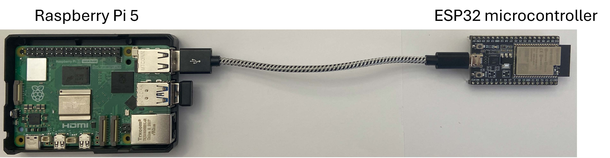

# Hardware Prototype

The Green-Light Security prototype demonstrates the architectural separation
between a fast common path and a slower off-path recovery path.

## Hardware

- Raspberry Pi 5
- ESP32 microcontroller
- USB connection between the two boards

## Prototype roles

### Raspberry Pi 5

The Raspberry Pi 5 represents the fast computing / memory tier.

It runs Linux and executes the Python experiment code in
[`../raspberry-pi/`](../raspberry-pi/).

The Pi is used to measure and emulate the operations associated with the
common path, including local integrity-check timing and software
Reed–Solomon decoding.

### ESP32

The ESP32 represents a physically separate off-path tier.

In the prototype, communication between the Raspberry Pi and ESP32 provides
a measurable remote-access latency that is used to represent the additional
cost of reaching an off-path reliability resource.

No production HBM, DRAM, or hardware ECC implementation is claimed by this
prototype.

## What the prototype validates

The purpose of the prototype is to test the timing structure of the proposed
architecture:

1. inexpensive local work remains on the common path;
2. an external tier is accessed only when the recovery path is invoked; and
3. the common-path and recovery-path latencies are physically separated.

The prototype is therefore an architectural emulation rather than a
cycle-accurate implementation of an HBM memory controller.

## Measurement boundary

The reported Raspberry Pi Reed–Solomon latency is software execution time
using a Python Reed–Solomon library. It should not be interpreted as the
latency of a production hardware ECC decoder.

Likewise, the Raspberry Pi–ESP32 round-trip time represents the measured
latency of this prototype's external path, not a prediction of a specific
production DRAM interface.

See the paper for the analytical model and interpretation of these
measurements.
